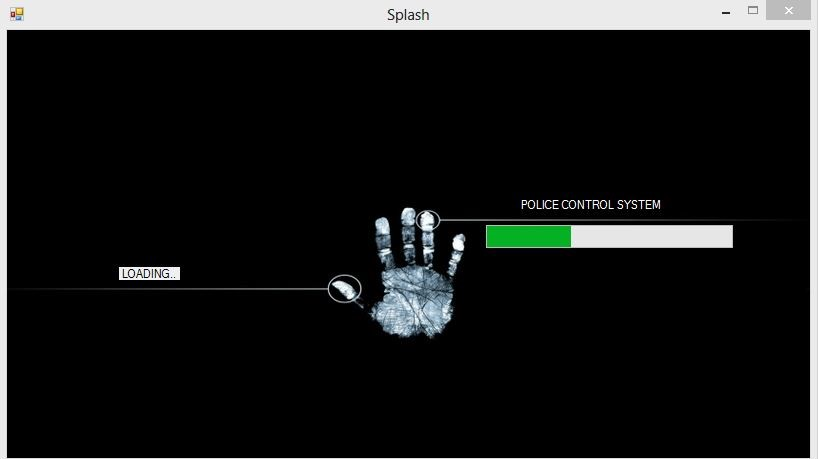
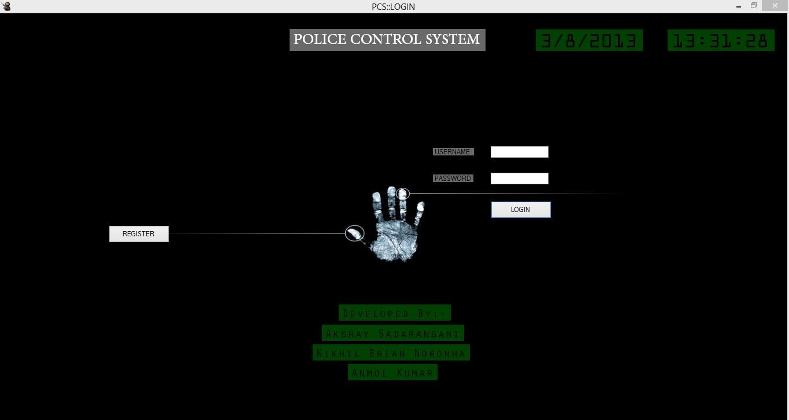
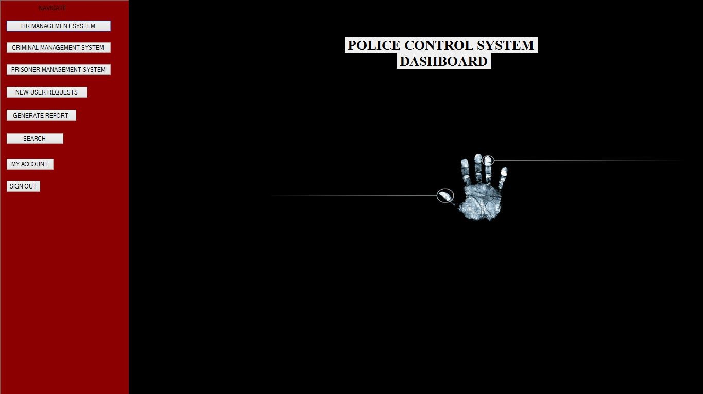
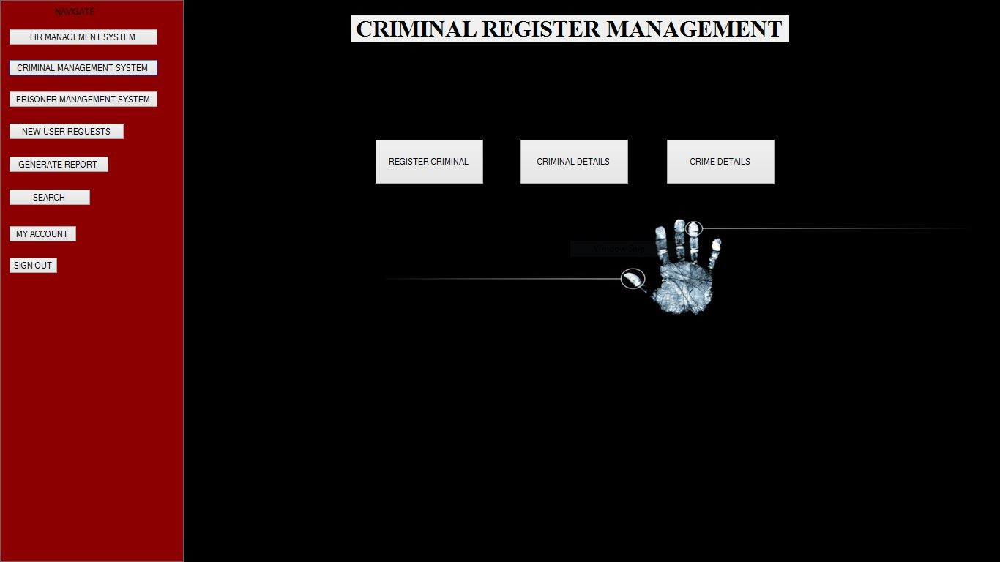
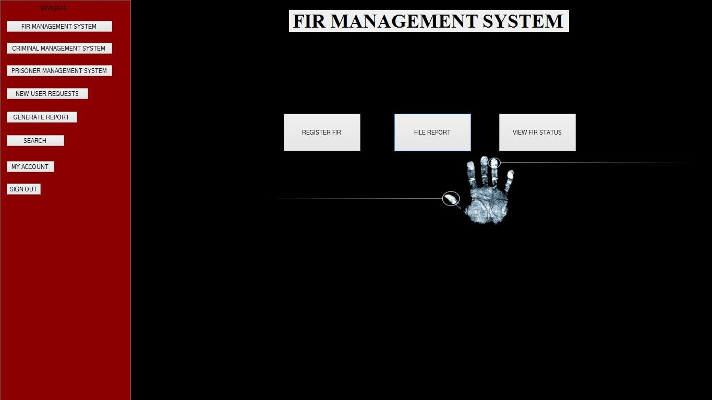
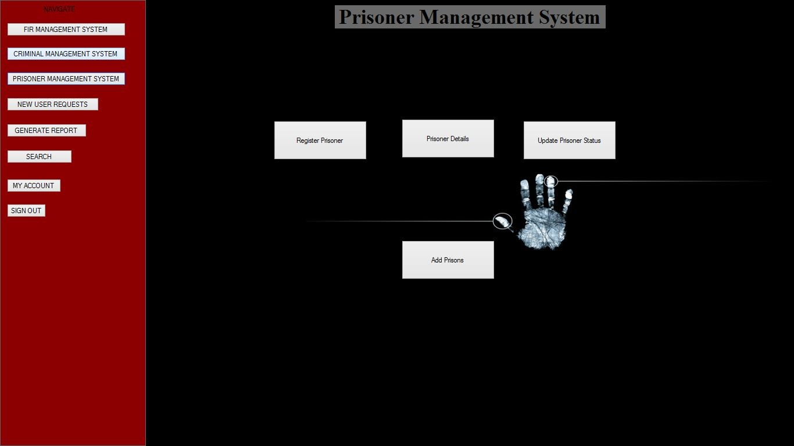
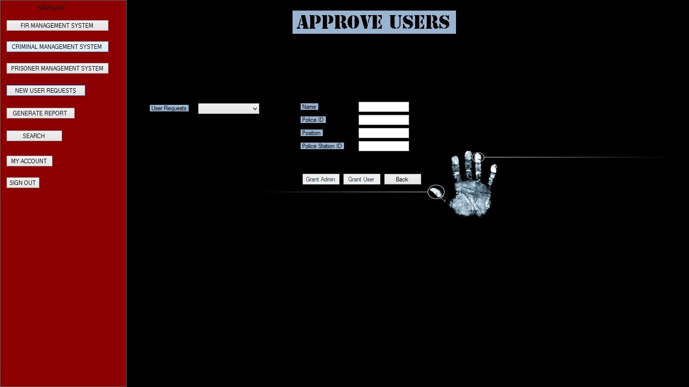
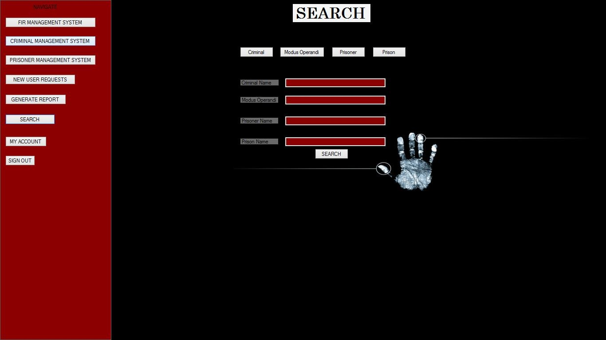
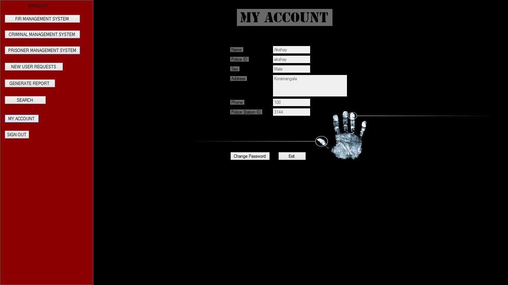

# Police Control System (PCS)
## Introduction
Police Control System (PCS) is a software to aid the police system/administration in maintaining the crime records, FIR records, case records and prisoner records in a country segregated on the basis of different states, cities and police stations in the local areas. Currently there is still a lot of manual work and by computerizing all the activities inside a police station results in easy and effective management.
This project will be done using .NET as front end, and Oracle as back end. It can used to register crimes and FIRs. This project is mainly useful for police stations. This system will help to manage most of the activities in a police station (pertaining to data management) using computers. Currently all of this work is done manually. By computerizing it, the activities inside a police station can be managed easily and effectively.
## Modules
> * Login
> * FIR Management System
> * Criminal Management System (CMS
> * Prisiner Management System (PMS)
> * Search Module
> * Report Generation
> * Account Management
> * New User Management
## Screenshots

